# SocialNewsApp

Aplikacja nie jest jeszcze skończona, pozostalo do napisania: chat, dodawanie komentarzy na NewBlog oraz dodanie czarnej listy tagów i userów do queries. Poniżej ss'y tego co działa.

1. Strona główna
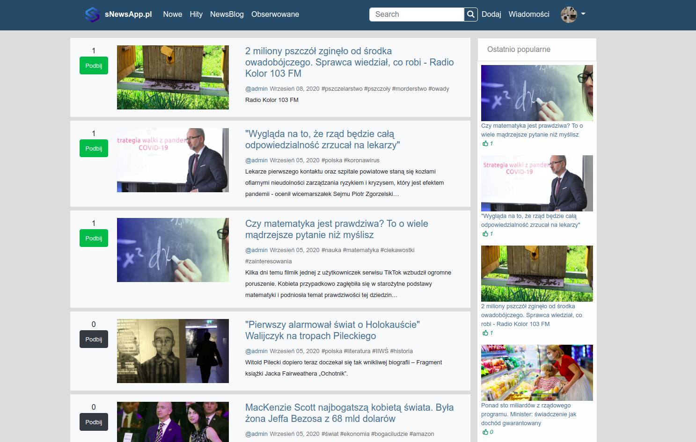
2. Strona główna, widok na mobilce

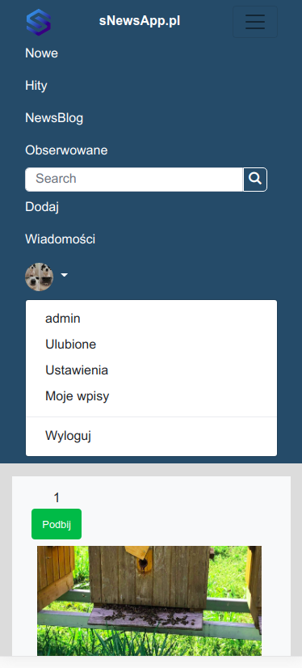

3. Mini blog

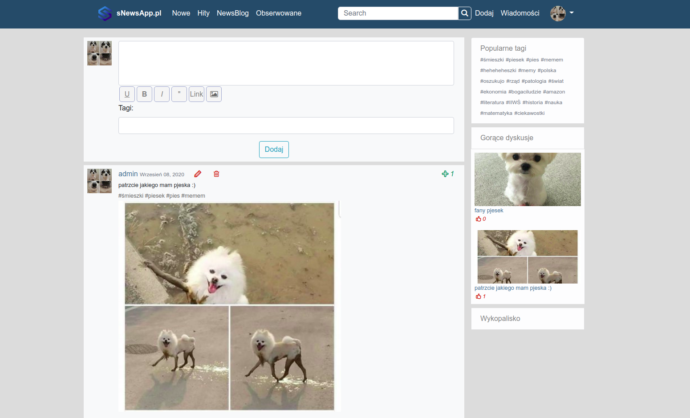
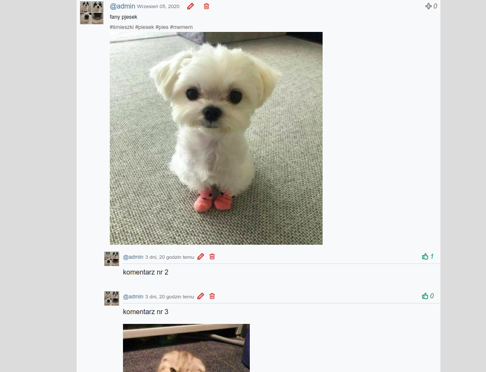

4. Mini blog widok na mobilce

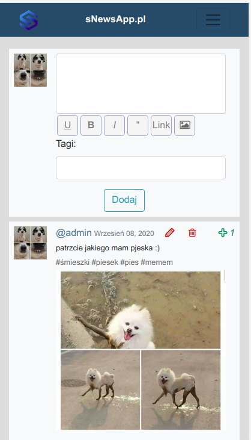

5. Dodawanie artykułów 
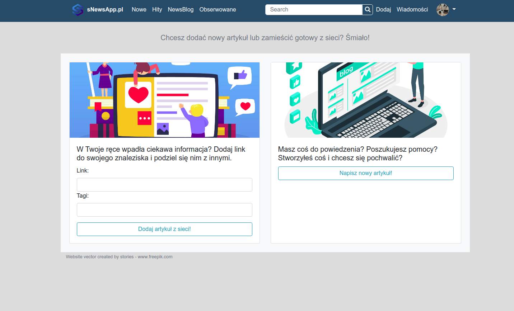

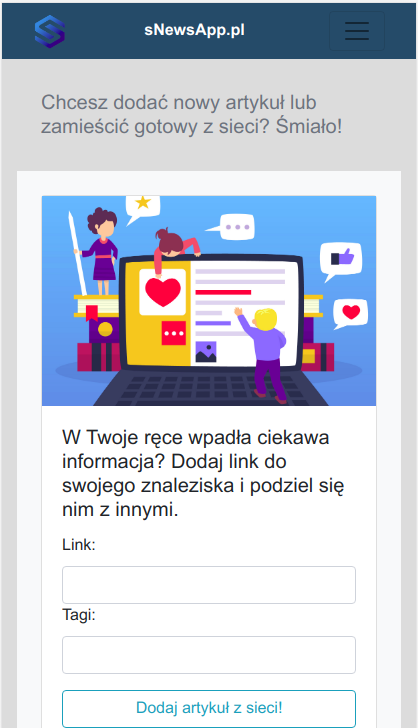

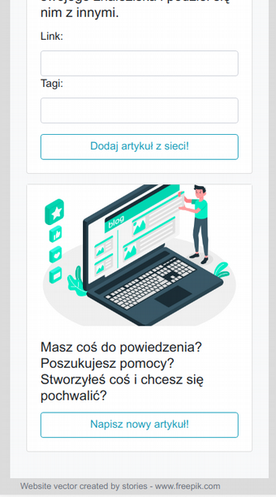

7.Profil usera
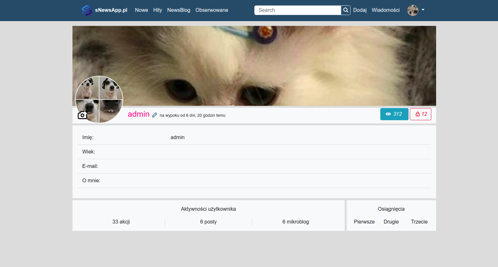

8. Profil usera widok na mobilce

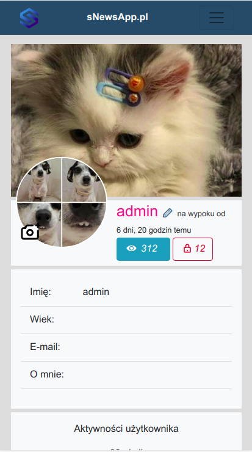

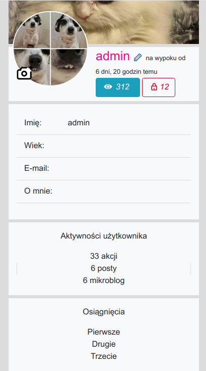

9. Edycja profilu usera widok na mobilce

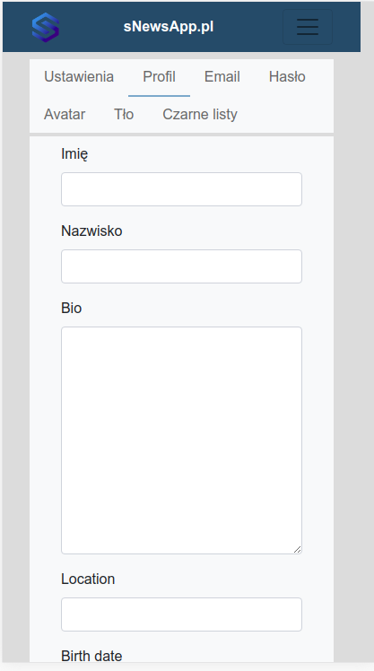

10. Widok po kliknięciu na #tag - posty i wpisy z danym tagiem

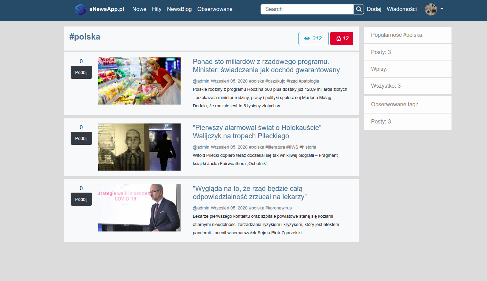

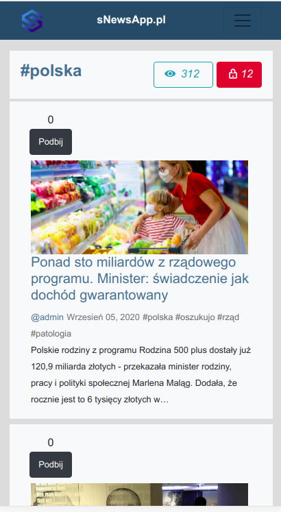

